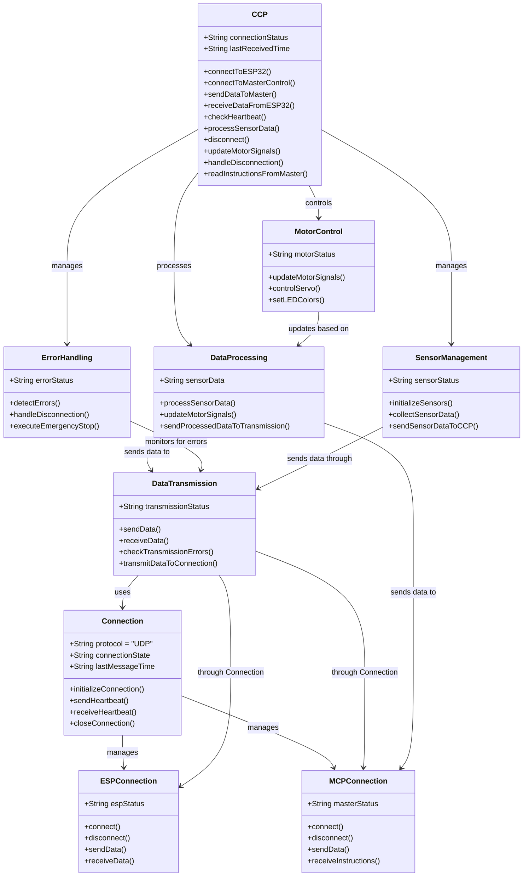
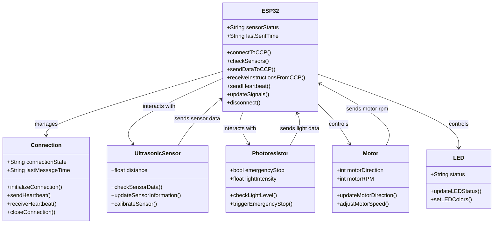
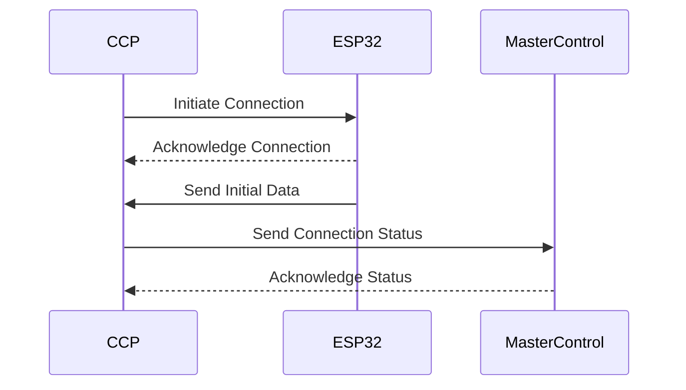
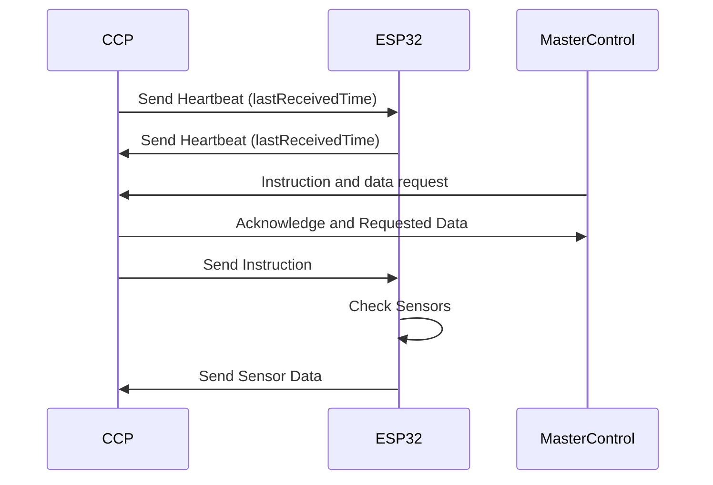
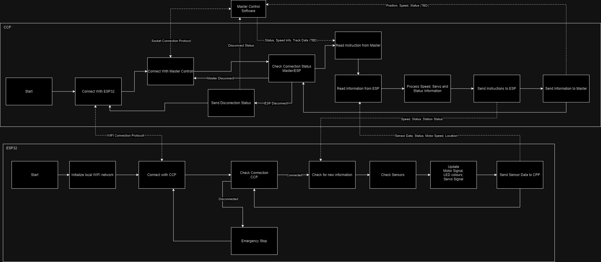

# Detailed Design

## UML Diagrams for CCP and ESP32 Subsystems

```mermaid
classDiagram
    %% Main CCP class and its components
    class CCP {
        +String connectionStatus
        +String lastReceivedTime
        +connectToESP32()
        +connectToMasterControl()
        +sendDataToMaster()
        +receiveDataFromESP32()
        +checkHeartbeat()
        +processSensorData()
        +disconnect()
        +updateMotorSignals()
        +handleDisconnection()
        +readInstructionsFromMaster()
    }

    %% Parent Connection Class
    class Connection {
        +String protocol = "UDP"
        +String connectionState
        +String lastMessageTime
        +initializeConnection()
        +sendHeartbeat()
        +receiveHeartbeat()
        +closeConnection()
    }

    %% ESP Connection Subclass
    class ESPConnection {
        +String espStatus
        +connect()
        +disconnect()
        +sendData()
        +receiveData()
    }

    %% MCP (Master Control Processor) Connection Subclass
    class MCPConnection {
        +String masterStatus
        +connect()
        +disconnect()
        +sendData()
        +receiveInstructions()
    }

    %% Data processing and communication with Master Control
    class DataProcessing {
        +String sensorData
        +processSensorData()
        +updateMotorSignals()
        +sendProcessedDataToTransmission()
    }

    %% Motor Control and Signals
    class MotorControl {
        +String motorStatus
        +updateMotorSignals()
        +controlServo()
        +setLEDColors()
    }

    %% Error Handling and Emergency Procedures
    class ErrorHandling {
        +String errorStatus
        +detectErrors()
        +handleDisconnection()
        +executeEmergencyStop()
    }

    %% Sensors and their management
    class SensorManagement {
        +String sensorStatus
        +initializeSensors()
        +collectSensorData()
        +sendSensorDataToCCP()
    }

    %% Data transmission and reception
    class DataTransmission {
        +String transmissionStatus
        +sendData()
        +receiveData()
        +checkTransmissionErrors()
        +transmitDataToConnection()
    }

    %% Relationships and dependencies
    CCP --> DataProcessing : processes
    CCP --> MotorControl : controls
    CCP --> ErrorHandling : manages
    CCP --> SensorManagement : manages
    DataProcessing --> DataTransmission : sends data to
    DataTransmission --> Connection : uses
    Connection --> ESPConnection : manages
    Connection --> MCPConnection : manages

    %% Additional dependencies
    DataTransmission --> ESPConnection : through Connection
    DataTransmission --> MCPConnection : through Connection
    DataProcessing --> MCPConnection : sends data to
    MotorControl --> DataProcessing : updates based on
    ErrorHandling --> DataTransmission : monitors for errors
    SensorManagement --> DataTransmission : sends data through

```

```mermaid
classDiagram
    %% Main ESP32 class and its components
    class ESP32 {
        +String sensorStatus
        +String lastSentTime
        +connectToCCP()
        +checkSensors()
        +sendDataToCCP()
        +receiveInstructionsFromCCP()
        +sendHeartbeat()
        +updateSignals()
        +disconnect()
    }

    %% Sensor Management Classes
    class UltrasonicSensor {
        +float distance
        +checkSensorData()
        +updateSensorInformation()
        +calibrateSensor()
    }

    class Photoresistor {
        +bool emergencyStop
        +float lightIntensity
        +checkLightLevel()
        +triggerEmergencyStop()
    }

    %% Motor and LED Control
    class Motor {
        +int motorDirection
        +int motorRPM
        +updateMotorDirection()
        +adjustMotorSpeed()
    }

    class LED {
        +String status
        +updateLEDStatus()
        +setLEDColors()
    }

    %% Connection-related classes
    class Connection {
        +String connectionState
        +String lastMessageTime
        +initializeConnection()
        +sendHeartbeat()
        +receiveHeartbeat()
        +closeConnection()
    }

    %% Relationships and dependencies
    ESP32 --> Connection : manages
    ESP32 --> UltrasonicSensor : interacts with
    ESP32 --> Photoresistor : interacts with
    ESP32 --> Motor : controls
    ESP32 --> LED : controls

    UltrasonicSensor --> ESP32 : sends sensor data
    Photoresistor --> ESP32 : sends light data
    Motor --> ESP32 : sends motor rpm
```

## Sequence Diagrams for Connection and Data Transfer

```mermaid
sequenceDiagram
    participant CCP
    participant ESP32
    participant MasterControl

    CCP ->> ESP32: Initiate Connection
    ESP32 -->> CCP: Acknowledge Connection
    ESP32 ->> CCP: Send Initial Data
    CCP ->> MasterControl: Send Connection Status
    MasterControl -->> CCP: Acknowledge Status

```

```mermaid
sequenceDiagram
    participant CCP
    participant ESP32
    participant MasterControl

    CCP ->> ESP32: Send Heartbeat (lastReceivedTime)
    ESP32 ->> CCP: Send Heartbeat (lastReceivedTime)
    
    MasterControl ->> CCP: Instruction and data request
    CCP ->> MasterControl: Acknowledge and Requested Data

		CCP ->> ESP32: Send Instruction
    ESP32 ->> ESP32: Check Sensors
    ESP32 ->> CCP: Send Sensor Data

```

## Program flow diagram (from preliminary deisgn)

